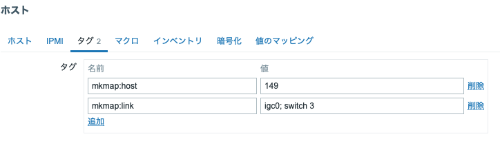

# mkmap
Yet another semi-automatic mapmaker for Zabbix

## これは何？

TL;DR: これは、Zabbix で監視中のホスト(群)を Zabbix のマップに(半)自動的に登録するツールである。


- [Zabbix](https://www.zabbix.com/documentation/current/en/manual/)
  でネットワーク監視をする時、Zabbix のマップ機能を使って
  マップ上に配置したホストの状況を一目で確認できるようにする場合がある。
- しかし、WebUI からマップを作成して手動でホストを配置するしかなく、
  (半)自動化が待たれていた。
- この分野では、SonmoneIT 社の Pascal De Jessey さんが先鞭を付けている。
  - [GitHub: SomoneIT/zabbix-AutoMapper](https://github.com/SomoneIT/zabbix-AutoMapper)
  - [Youtube: Automating Network Map Generetion](https://www.youtube.com/watch?v=uAzA6cMsa7A)
- しかし、zabbix-AutoMapper は一部のパラメータがハードコードされているなど、
  僕にとっては少し扱いづらかった。
- とりあえず動くようにするパッチはこちら。
  ``` diff
  --- zabbix-AutoMapper/createEnv.py	2026-09-10 14:59:30
  +++ zabbix-AutoMapper-mk/createEnv.py	2026-09-02 11:08:38
  @@ -18,11 +18,22 @@
   
   
   def create_host(host_name, type="server", link="", host_group="",ip="",link_label=""):
  +
  +    # please create 'automap' template by hand prior to run this code.
  +    automap_templates = api.template.get(filter={'name': 'automap'})
  +    if len(automap_templates) == 1:
  +        automap_template = automap_templates[0]
  +        automap_template_id = automap_template['templateid']
  +        print(f'automap_template_id: {automap_template_id}')
  +    else:
  +        print('automap template not exits.')
  +        exit(2)
  +
       result = api.host.create({
           "host": host_name,
                   "templates": [
               {
  -                "templateid": "11267"
  +                "templateid": automap_template_id
               }
           ],
           "interfaces": [
  @@ -75,14 +86,29 @@
   
   def delete_hosts_from_host_group(hostgroup_id):
       hosts = get_list_hosts_from_host_group(hostgroup_id)
  -    host_array=[host["hostid"] for host in hosts]
   
  -    result = api.host.delete(*host_array)
  +    print(f'hosts in automap host group: {hosts}.')
  +    for host in hosts:
  +        host_id = host['hostid']
  +        api.host.delete([host_id])
   
  +    ### host_array=[host["hostid"] for host in hosts]
  +
  +    ### result = api.host.delete(*host_array)
  +
       return True
   
   
  -host_group_id = 38
  +### host_group_id = 38
  +automap_hostgroups = api.hostgroup.get(filter={'name': ['automap']})
  +if len(automap_hostgroups) == 1:
  +    automap_hostgroup = automap_hostgroups[0]
  +    host_group_id = automap_hostgroup['groupid']
  +    print(f'automap host group id: {host_group_id}')
  +else:
  +    print('cannot get automap host group.')
  +    exit(1)
  +
   delete_hosts_from_host_group(host_group_id)
   
   for i in range(1, 41):
  --- zabbix-AutoMapper/automapLib/zabbix.py	2026-09-10 14:59:30
  +++ zabbix-AutoMapper-mk/automapLib/zabbix.py	2026-09-02 11:45:28
  @@ -24,7 +24,7 @@
   
       def create_api(self):
           self.logger.info(f"create zabbix api")
  -        self.api = ZabbixAPI(url=self.zabbix_url, token=self.zabbix_token, skip_version_check=True)
  +        self.api = ZabbixAPI(url=self.zabbix_url, token=self.zabbix_token, skip_version_check=True, validate_certs=False)
   
       def get_hosts_in_host_group_name(self, host_group_name) -> list[Host]:
           groupid = self.get_host_group_from_name(host_group_name)
  ```
- そこで、スクラッチから [mkmap.py](./mkmap.py) を書いた。
  - De Jessey さんの zabbix-AutoMapper がなければ、mkmap.py もなかっただろう。
    特に記して感謝したい。
- というわけで、これは、Zabbix で監視中のホスト(群)を Zabbix のマップに
  (半)自動的に登録するツールである。

## 環境情報

このスクリプトは、
- FreeBSD 15.1-RELEASE-p2 上で
- Ports からインストールした Zabbix 7.0.28 サーバを動かし、
- macOS Tahoe 26.6.2 上に MacPorts から入れた Python 3.14.7 及び
  (なるべく MacPorts から入れた) 関連する Python パッケージを使って作成された。

## インストール

- Python 3.14 が動く環境を準備して、
- [requirements.txt](./requirements.txt) にある Python パッケージをインストールして、
- 適当なディレクトリに mkmap.py を置くだけでよいはず。
  - `chmod 755` するのか `python mkmap.py` で動かすのかとか shbang の調整とか。
- 同じディレクトリに、[token.txt](./token.txt) を置く。このファイルには、Zabbix のトークンを入れておく。
- パッケージ化もしてない手抜きです。ごめんね。

## 使い方

### Zabbix サーバ側の準備

- 動作している Zabbix サーバを準備して、いくつかのホストを監視する。
- Zabbix マップに描画したいホスト群を mkmap ホストグループに所属させる。
  - mkmap ホストグループは、なければ作成する。
- 各ホストに `mkmap:host` タグを付ける。これは、そのホストに関する情報を示す。
  
  - タグ名 `mkmap:host` に対して、zabbix マップ上に表示されるアイコンの ID を
    示す値 `149` 等を設定する。(後述の「アイコンIDの探し方」を参照のこと)
  - 例： `mkmap:host ==> 149`
  - `mkmap:host` タグは、ホスト１個についてちょうど１個なければならない。
- 各ホストに `mkmap:link` タグを付ける。これは、そのホストから伸びるリンクの情報を
  示す。
  - タグ名 `mkmap:link` に対して、インタフェース名と対向ホスト名を
    `;` で区切って与える。
  - インタフェース名は、そのリンクの自ホスト側のインタフェースで、例えば `fxp0` 。
  - 対向ホスト名は、そのリンクのリモート側のホストの名前。例えば `router1` 。
  - 例： `mkmap:link ==> fxp0;router1`
  - `mkmap:link` タグは、ホスト１個についていくつ合っても良い。
    (0 個でも 1 個でもよいし、複数個あっても良い)
- Zabbix サーバの API トークンを作成して、token.txt に保存する。
  - このトークンを使って、ホストの情報を読み出し、Zabbix マップを作成・編集する
    等を行うので、それに足りる権限を持たせること。
  - 権限さえ足りていれば、トークンの名前・対応ユーザ・有効期限は何でもよい。
  - 蛇足ながら、 `chmod 600 token.txt` 等はしておいてね。

### mkmap.py の使い方

- とりあえず、ヘルプを見てほしい。
  ``` shell
  $ ./mkmap.py -h
  usage: mkmap [-h] [-z URL] [-f TOKEN_FILE] [-m MAP] [-s MAP_SIZE] [-g HOSTGROUP] [-t TAG_PREFIX] [-o OUTPUT] [-k]
               [-l {DEBUG,INFO,WARNING,ERROR,CRITICAL}]
  
  program for making a map on zabbix
  
  options:
    -h, --help            show this help message and exit
    -z, --url URL         the URL where Zabbix server locates. defaults to "https://127.0.0.1/".
    -f, --token-file TOKEN_FILE
                          file name which contain the token to login to the Zabbix server. defaults to "./token.txt".
    -m, --map MAP         The Zabbix map name where the map to be drawn. defaults to "mkmap". Be cautioned this map being flushed
                          even if it contains nodes/links, or created if not exists.
    -s, --map-size MAP_SIZE
                          zabbix map size, width and height joined by "x". defaults to "800x800".
    -g, --hostgroup HOSTGROUP
                          The hostgroup name in which hosts to be mapped in the map listed. defaults to "mkmap".
    -t, --tag-prefix TAG_PREFIX
                          The tag name prefix which represent node/link attributes. defaults to "mkmap". The value consists of
                          remote node name and link label separated by semi-colomn, i.e. "<remote node>;<link label>".
    -o, --output OUTPUT   The output file name such as "./mkmap.svg" or "./mkmap.png". will not write if not specified, and will
                          overwrite if did.
    -k, --no-validate-certs
                          disable validation of the SSL/TLS certs.
    -l, --log-level {DEBUG,INFO,WARNING,ERROR,CRITICAL}
                          log level. defaults to "WARNING".
  
  copyright 2026 by moto kawasaki <moto@kawasaki3.org>
  ```
- ここまでの準備をしていれば、多分これで動く。
  `./mkmap.py -z https://zabbix.example.com/`
- これは、デフォルト値を明示するならこういうコマンドラインになっている。
  ```
  $ ./mkmap.py -z https://zabbix.example.com/
               -f ./token.txt
               -m mkmap
               -s 800x800
               -g mkmap
               -l WARNING
  ```
- `mkmap.py` スクリプトが正常に動作すれば、 Zabbix サーバ側に mkmap という名前の
  マップが作成されて、そこにネットワーク図が描かれているはず。
- 各オプションの意味する所は次の通り。
  - -z/--url: Zabbix サーバの URL を与える。
    - API 作成時に、この URL の直下に `api_jsonrpc.php` が存在することが期待される。
    - デフォルト値は `https://127.0.0.1/` 。
  - -f/--token-file: Zabbix サーバで作ったトークンを保存したテキストファイル。
    - API 作成時にこのトークンでログインを試みる。
    - デフォルト値は `./token.txt` 。
  - -m/--map: `mkmap.py` が Zabbix サーバ側に作成するマップの名前。
    - なければスクリプトが作成してから描画する。
    - あれば、その内容をすべて削除してから描画する。
    - 上書きされてしまうので、既存のマップの名前を指定することは推奨しない。
    - デフォルト値は `mkmap` 。
  - -s/--map-size: Zabbix マップのサイズで、縦と横のピクセル数。
    - レイアウト作成時、つまりホストをマップ上のどこに配置するかを決める時に
      kamada-kawai のアルゴリズムを使う関係で、正方形が望ましい。
      長方形だと、長辺方向の両端が余る。
    - デフォルト値は `800x800` で、800 ピクセル掛ける 800 ピクセルの正方形。
  - -g/--hostgroup: このホストグループに所属しているホストのネットワーク図を描く。
    - デフォルト値は `mkmap` 。
  - -t/--tag-prefix: 各ホストに付けるタグのキーにのプレフィクス。
    - 各ホストの情報については `<prefix>:host` タグ、
      各ホストのリンク情報については、 `<prefix>:link` タグを用いることになる。
    - デフォルト値は `mkmap` なので、 `mkmap:host` タグと `mkmap:link` タグを
      設定することになる。
  - -o/--output: ネットワーク図をファイルに書き出す際の出力先ファイル名で、
    例えば `x.svg` や `x.png` 等を指定する。
    - 指定しなければ、ファイルに書き出す動作を行わない。
    - 指定した場合でも、 Zabbix マップに対する操作は実行する。
    - デフォルトでは指定なし、したがって、画像ファイルを書き出さない。
  - -k/--no-validate-certs: SSL サーバ証明書の検証を行わない。
    - 自己署名のものを使っている場合等にはこのオプションを指定することが必要。
    - デフォルトでは、SSL サーバ証明書を検証する。
  - -l/--log-level: ログレベル(メッセージ表示レベル)の指定。
    - ログレベルに応じてメッセージを標準エラーに出力する。
    - デフォルト値は `WARNING` で、問題がなければ何も表示しない。
    - ごめん、ソースコード上ではかなり適当にやっている。手抜き。すまぬ。

## 補足

### アイコン ID の探し方

- 各ホストに付けるタグで、 `mkmap:host` の値としてアイコン ID を設定する。
- これが、 Zabbix マップ上でそのホストを示すアイコンとして使われる。
- ここでいうアイコンは、 Zabbix の WebUI で 管理/一般設定/イメージ のページに
  一覧表示されるものである。
- ここから一つのアイコンを選んでクリックすると、そのアイコン１個に関する名前・
  イメージ画像や、アップロードする場合にはファイルを選択できるページが表示されるが、
  このページの URL の末尾に `imageid=30` のような引数が見えるはず。
  この値 (この例なら `30` の部分) が、我々の言うアイコン ID である。
- よく使うのはこんな感じ？
  - サーバなら `149`
  - ルータなら `129`
  - スイッチなら `38`
  - Zabbix サーバなら `186`

### ホスト名(host.host)と表示名(host.name)に関する注釈

- Zabbix では、「ホスト名」(host.host) と「表示名」(host.name) の２種類の名前を扱う。
- 「ホスト名」はホスト登録時に必須のパラメータで、オプションの「表示名」を設定しなければ
  「ホスト名」を表示する。
- Zabbix Agent が Zabbix サーバにデータを送る時に、「ホスト名」を識別子として使う。
- API 経由でホストの情報を取得した時に、`host.host` に「ホスト名」、
  `host.name` に「表示名」が格納される。
- ここまでの説明でホスト名と言っているのは、「ホスト名」(host.host) の方である。

## ライセンス

[The 3-Clause BSD License](./LICENSE)
